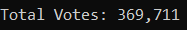
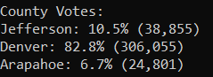
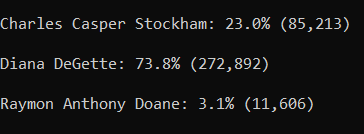
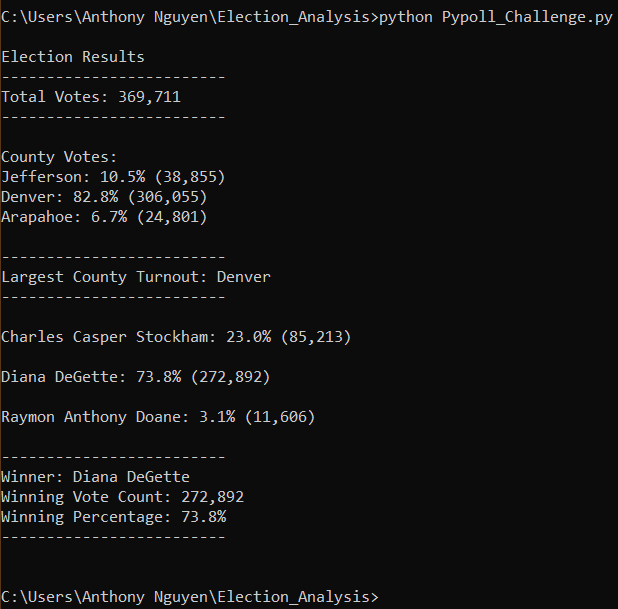
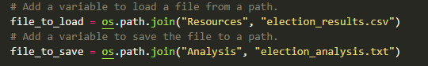
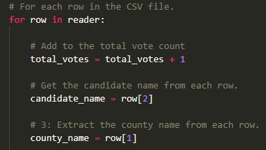

# Election Analysis

## Overview of Election Audit

### Purpose

We are helping Tom, a board of elections employee, with an audit of the U.S. Congressional Precint in Colorado. We will report the total number of votes, number of votes for each candidate, and the winner of the election. If succesful, we can use this code to audit other elections.

## Analysis

### Election-Audit Results
- Votes casted in this congressional election:
 
  

- Breakdown of the number of votes and the percentage of total votes for each county in the precinct:
 
  

- County with largest number of votes:

  From the results we can see that **Denver County** had the largest number and percentage of votes. 306,055 votes for 82.8%. 
 

- Breakdown of the number of votes and the percentage of the total votes each candidate received:

  

- Winner of Election:

  **Diana DeGette** (272,892 votes, 73.8% of total votes)

## Election-Audit Summary

### Business Proposal
After working with Tom, we were able to succesffuly audit the U.S. Congressional Precinct Election:

I believe we can do more work together in the future. With some changes to our script, we can audit other elections with different counties and candidates. 

#### Example 1

After we are given a new .csv file with the data collected from an election, we can simply change "election_results.csv" to "new_filename.csv" and our code with be able to pull in the new data

#### Example 2

If our new data is not organized correctly (ballot id, county, candidate); we can simply change row[1] and row[2] to match the headers of our new data. with row[0] pulling data from the first column and row[1] pulling data from the 2nd column and row[2] to pull data from the third column
